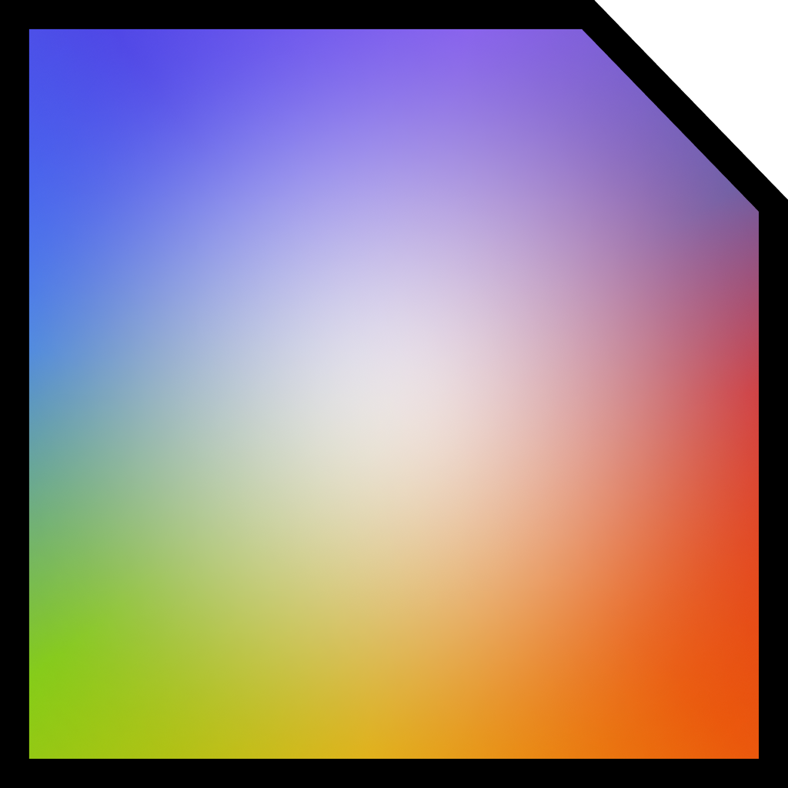

# ManyCore Visualiser

ManyCore Visualiser is a Graphical User Interface program to generate renders of 2D matrix mesh NoC many-core systems.

It allows exporting the renders in `SVG` and `PNG` formats.
